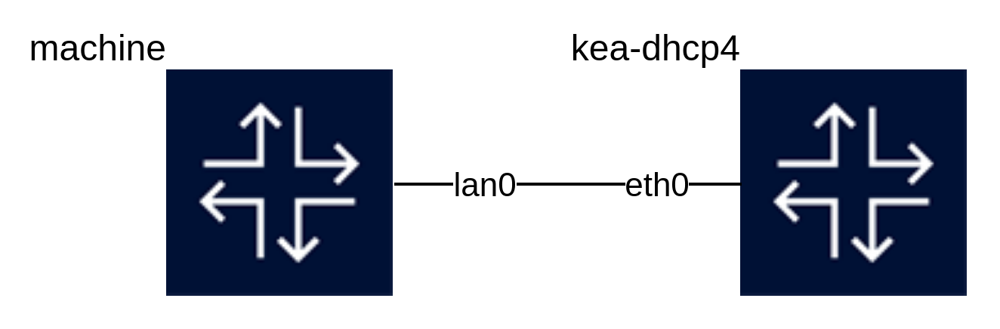

# Containerlab IPMI

OpenIPMI: https://github.com/cminyard/openipmi



Build image:
```bash
docker build -t localhost/machine image
```

Show BMC info:
```bash
docker exec -it clab-ipmi-machine ipmitool -I lanplus -U ipmiusr -P test -p 9001 -H 127.0.0.1 mc info
```

Show channel information:
```bash
docker exec -it clab-ipmi-machine ipmitool -I lanplus -U ipmiusr -P test -p 9001 -H 127.0.0.1 lan print 1
```

Power on the VM:
```bash
docker exec -it clab-ipmi-machine ipmitool -I lanplus -U ipmiusr -P test -p 9001 -H 127.0.0.1 chassis power on
```

Power reset:
```bash
docker exec -it clab-ipmi-machine ipmitool -I lanplus -U ipmiusr -P test -p 9001 -H 127.0.0.1 chassis power reset
```

Access to the serial console:
```bash
docker exec -it clab-ipmi-machine ipmitool -I lanplus -U ipmiusr -P test -H 127.0.0.1 -p 9001 sol activate
```
